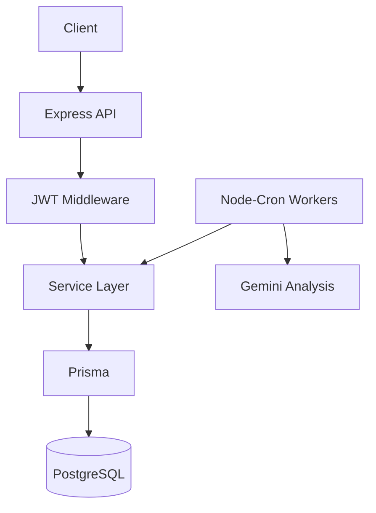

# 🛡️ OpsMind: Smart Microservice Monitoring


OpsMind es una plataforma de monitoreo y observabilidad de microservicios enfocada en disponibilidad, seguimiento de estados y análisis operacional de servicios distribuidos.

Diseñado bajo arquitectura **API-First**, con workers en segundo plano, autenticación JWT y análisis inteligente con IA.

---

# 📚 Tabla de Contenidos

- [Características](#-características-principales)
- [Stack](#-stack-tecnológico)
- [Arquitectura](#-arquitectura-general)
- [API](#-api-endpoints-v1)
- [Estados](#-estados-del-sistema)
- [Instalación](#-instalación-y-ejecución)
- [Testing](#-pruebas-automatizadas)
- [IA](#-análisis-inteligente-con-ia)
- [Producción](#-producción-render)
- [Roadmap](#-roadmap)
- [Autor](#-autor)

---

# ✨ Características Principales

- API-First con respuestas JSON consistentes
- Seguridad global con JWT
- Health monitoring engine en tiempo real
- Background workers con `node-cron`
- Swagger/OpenAPI en vivo
- Arquitectura desacoplada con Prisma
- Contenerización con Docker
- Análisis de incidentes con IA (Gemini)

---

# 🛠️ Stack Tecnológico

| Tecnología | Uso |
|------------|-----|
| Node.js | Runtime |
| Express | API HTTP |
| Prisma ORM | Base de datos |
| PostgreSQL | Persistencia |
| Node-Cron | Workers |
| Jest + Supertest | Testing |
| Swagger UI | Documentación |
| OpenAPI 3.0 | Especificación |
| Docker | Contenedores |
| GitHub Actions | CI |
| Gemini API | IA de incidentes |

---

# 🧠 Arquitectura General



---

# 📡 API Endpoints (v1)

## 🔐 Auth

| Método | Endpoint              | Descripción |
| ------ | --------------------- | ----------- |
| POST   | /api/v1/auth/register | Registro    |
| POST   | /api/v1/auth/login    | Login + JWT |

---

## 📊 Monitors (Protegido)

Authorization requerido:

```http
Authorization: Bearer <token>
```

| Método | Endpoint             | Descripción      |
| ------ | -------------------- | ---------------- |
| GET    | /api/v1/monitors     | Listar monitores |
| POST   | /api/v1/monitors     | Crear monitor    |
| PATCH  | /api/v1/monitors/:id | Actualizar       |
| DELETE | /api/v1/monitors/:id | Eliminar         |

---

## 📈 Observabilidad

| Método | Endpoint                      | Descripción         |
| ------ | ----------------------------- | ------------------- |
| GET    | /api/v1/monitors/status/all   | Estado general      |
| GET    | /api/v1/monitors/status/:site | Estado por servicio |
| GET    | /api/v1/monitors/:id/history  | Historial           |

---

# 📊 Estados del Sistema

## ServiceStatus

* UP → funcionando
* DEGRADED → lento o inestable
* DOWN → caído
* PENDING → sin datos

## TrendStatus

* STABLE → estable
* RECOVERED → recuperación
* DROP_DETECTED → caída
* OFFLINE → caído persistente

## CriticalityLevel

* LOW
* MEDIUM
* HIGH
* CRITICAL

---

# 🚀 Instalación y Ejecución

## 1. Clonar repo

```bash
git clone https://github.com/LENINMORENO13/OpsMind.git
cd OpsMind
```

## 2. Variables de entorno

```bash
cp .env.example .env
```

## 3. Docker

```bash
docker compose up --build
```

* API: [http://localhost:3000](http://localhost:3000)
* Swagger: [http://localhost:3000/api-docs](http://localhost:3000/api-docs)
* DB: PostgreSQL (db:5432)

## 4. Detener

```bash
docker compose down
```

---

# 🧪 Pruebas Automatizadas

```bash
npm test
```

Incluye:

* Auth JWT
* CRUD Monitors
* Validaciones 401 / 400 / 404
* Prisma + DB real

---

# 🤖 Análisis Inteligente con IA

OpsMind usa Gemini para:

* Diagnóstico automático
* Causa probable
* Acción recomendada

```bash
GEMINI_API_KEY=tu_key
```

---

# 🌐 Producción (Render)

* API: [https://opsmind-e07b.onrender.com](https://opsmind-e07b.onrender.com)
* Docs: [https://opsmind-e07b.onrender.com/api-docs](https://opsmind-e07b.onrender.com/api-docs)

---

# 🎯 Roadmap

* [x] API REST modular
* [x] JWT global security
* [x] Swagger docs
* [x] Workers con cron
* [x] Docker setup
* [x] IA con Gemini
* [x] Testing completo
* [x] CI/CD con GitHub Actions

---

# 👤 Autor

**Lenin Moreno** - Backend Developer  
Enfocado en sistemas distribuidos, observabilidad y backend resiliente.

🛸 **¡Conectemos!**
* [🌐 LinkedIn](https://www.linkedin.com/in/lenin-moreno/)
* [💼 Portafolio Web / Gitvlg](https://leninmoreno13.gitvlg.com/)