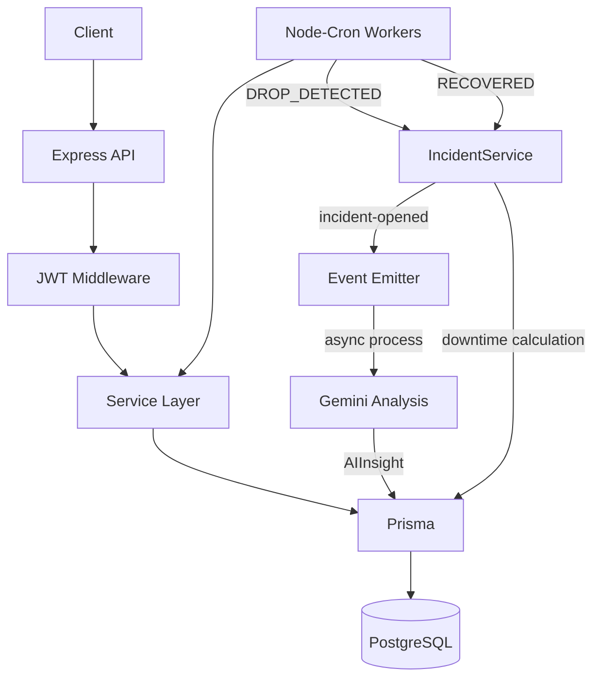

# 🛡️ OpsMind: Smart Microservice Monitoring


OpsMind es una plataforma de monitoreo y observabilidad de microservicios enfocada en disponibilidad, seguimiento de estados y gestión inteligente de incidentes.

Diseñada bajo arquitectura **API-First**, con workers en segundo plano, autenticación JWT, persistencia de incidentes y análisis operacional mediante IA.

---

# 📚 Tabla de Contenidos

* [Características](#-características-principales)
* [Stack](#-stack-tecnológico)
* [Arquitectura](#-arquitectura-general)
* [API](#-api-endpoints)
* [Incidentes](#-gestión-de-incidentes)
* [Estados](#-estados-del-sistema)
* [Instalación](#-instalación-y-ejecución)
* [Testing](#-pruebas-automatizadas)
* [IA](#-análisis-inteligente-con-ia)
* [Evolución V1 → V2](#-evolución-v1--v2)
* [Producción](#-producción-render)
* [Autor](#-autor)

---

# ✨ Características Principales

* API-First con respuestas JSON consistentes
* Seguridad global con JWT
* Health monitoring engine en tiempo real
* Background workers con `node-cron`
* Swagger/OpenAPI
* Arquitectura desacoplada con Prisma
* PostgreSQL para persistencia
* Contenerización con Docker
* CI/CD con GitHub Actions
* Análisis de incidentes con IA (Gemini)
* Memoria persistente de incidentes
* Seguimiento de incidentes activos y resueltos
* Cálculo de downtime
* Procesamiento de IA desacoplado mediante eventos

---

# 🛠️ Stack Tecnológico

| Tecnología       | Uso                    |
| ---------------- | ---------------------- |
| Node.js          | Runtime                |
| Express          | API HTTP               |
| Prisma ORM       | Acceso a datos         |
| PostgreSQL       | Persistencia           |
| Node-Cron        | Background workers     |
| Jest + Supertest | Testing                |
| Swagger UI       | Documentación          |
| OpenAPI 3.0      | Especificación         |
| Docker           | Contenedores           |
| GitHub Actions   | CI/CD                  |
| Gemini API       | Análisis de incidentes |

---

# 🧠 Arquitectura General



---

# 📡 API Endpoints

## 🔐 Auth

| Método | Endpoint                | Descripción |
| ------ | ----------------------- | ----------- |
| POST   | `/api/v1/auth/register` | Registro    |
| POST   | `/api/v1/auth/login`    | Login + JWT |

---

## 📊 Monitors

**Authorization requerido:**

```http
Authorization: Bearer <token>
```

| Método | Endpoint               | Descripción      |
| ------ | ---------------------- | ---------------- |
| GET    | `/api/v1/monitors`     | Listar monitores |
| POST   | `/api/v1/monitors`     | Crear monitor    |
| PATCH  | `/api/v1/monitors/:id` | Actualizar       |
| DELETE | `/api/v1/monitors/:id` | Eliminar         |

---

## 📈 Observabilidad

| Método | Endpoint                        | Descripción         |
| ------ | ------------------------------- | ------------------- |
| GET    | `/api/v1/monitors/status/all`   | Estado general      |
| GET    | `/api/v1/monitors/status/:site` | Estado por servicio |
| GET    | `/api/v1/monitors/:id/history`  | Historial           |

---

## 🚨 Incidentes

La V2 introduce memoria persistente de incidentes y seguimiento de su ciclo de vida.

| Método | Endpoint                                 | Descripción                                   |
| ------ | ---------------------------------------- | --------------------------------------------- |
| GET    | `/api/v1/incidents/active`               | Incidentes activos con diagnóstico IA         |
| GET    | `/api/v1/incidents/monitor/:id/resolved` | Historial de incidentes resueltos por monitor |

### Fase 1 — Incident Memory

* Persistencia de incidentes
* Seguimiento de incidentes activos y resueltos
* Cálculo automático de downtime
* Diagnóstico mediante IA
* Registro de resolución humana
* Procesamiento de IA desacoplado mediante eventos

### Flujo de incidentes

```text
DROP_DETECTED
      ↓
Incident created
      ↓
incident-opened
      ↓
Gemini analysis
      ↓
AIInsight persisted
      ↓
RECOVERED
      ↓
Incident resolved
      ↓
Downtime calculated
```

---

# 📊 Estados del Sistema

## ServiceStatus

* `UP` → funcionando
* `DEGRADED` → lento o inestable
* `DOWN` → caído
* `PENDING` → sin datos

## TrendStatus

* `STABLE` → estable
* `RECOVERED` → recuperación
* `DROP_DETECTED` → caída detectada
* `OFFLINE` → caído persistentemente

## CriticalityLevel

* `LOW`
* `MEDIUM`
* `HIGH`
* `CRITICAL`

## IncidentStatus

* `OPEN` → incidente activo
* `RESOLVED` → incidente resuelto
* `IGNORED` → incidente descartado

---

# 🚀 Instalación y Ejecución

## 1. Clonar repositorio

```bash
git clone https://github.com/LENINMORENO13/OpsMind.git
cd OpsMind
```

## 2. Variables de entorno

```bash
cp .env.example .env
```

## 3. Docker

```bash
docker compose up --build
```

* API: http://localhost:3000
* Swagger: http://localhost:3000/api-docs
* PostgreSQL: `db:5432`

## 4. Detener

```bash
docker compose down
```

---

# 🧪 Pruebas Automatizadas

```bash
npm test
```

Incluye pruebas para:

* Auth JWT
* CRUD de monitores
* Validaciones `401 / 400 / 404`
* Prisma + PostgreSQL
* Flujo de incidentes
* Procesamiento de IA

---

# 🤖 Análisis Inteligente con IA

OpsMind utiliza **Gemini** para analizar incidentes y generar información operacional estructurada.

El análisis incluye:

* Diagnóstico
* Causa probable
* Acción recomendada
* Nivel de criticidad

La IA se ejecuta de forma desacoplada mediante eventos:

```text
IncidentService
      ↓
incident-opened
      ↓
AIService
      ↓
Gemini
      ↓
AIInsight
```

El resultado utiliza un esquema estructurado para mantener compatibilidad con el modelo de datos.

```bash
GEMINI_API_KEY=tu_key
```

---

# 🔄 Evolución V1 → V2

## V1 — Monitoring Foundation

La primera versión establece la base de monitoreo y observabilidad:

* [x] API REST modular
* [x] Health monitoring
* [x] Service status
* [x] Service history
* [x] JWT authentication
* [x] Background workers
* [x] Swagger/OpenAPI
* [x] Docker
* [x] Testing
* [x] CI/CD
* [x] AI analysis

---

## V2 — Incident Intelligence

La segunda versión evoluciona OpsMind desde el monitoreo hacia la **gestión y análisis inteligente de incidentes**.

### Fase 1 — Incident Memory ✅

* [x] Persistencia de incidentes
* [x] Ciclo de vida del incidente
* [x] Cálculo de downtime
* [x] AIInsight persistente
* [x] ResolutionLog
* [x] IA desacoplada por eventos
* [x] API de incidentes activos y resueltos

### Próximas fases

Las siguientes fases estarán orientadas a aprovechar la memoria de incidentes para mejorar progresivamente la capacidad de análisis y operación de OpsMind.

* **Fase 2 — Pattern Detection**
* **Fase 3 — Historical Intelligence**
* **Fase 4 — Operational Recommendations**
* **Fase 5 — Operational Dashboard**

---

# 🌐 Producción (Render)

* API: https://opsmind-e07b.onrender.com
* Docs: https://opsmind-e07b.onrender.com/api-docs

---

# 👤 Autor

**Lenin Moreno** — Backend Developer

Enfocado en sistemas distribuidos, observabilidad y backend resiliente.

🛸 **¡Conectemos!**

* 🌐 [LinkedIn](https://www.linkedin.com/in/lenin-moreno/)
* 💼 [Portafolio Web / Gitvlg](https://leninmoreno13.gitvlg.com/)
