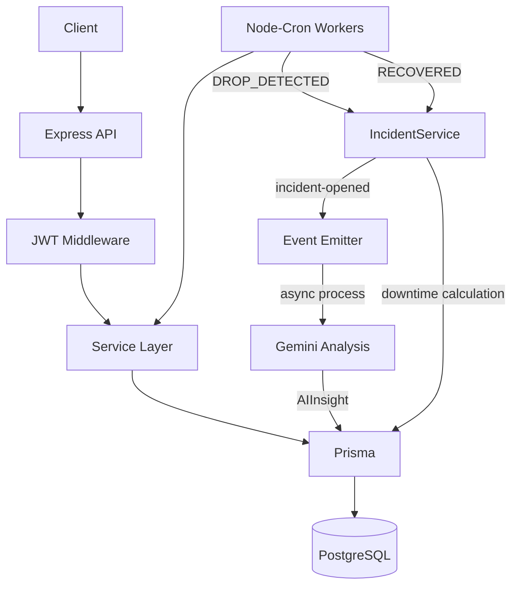

# 🛡️ OpsMind — Microservice Monitoring & Incident Analysis


OpsMind es una plataforma backend para monitoreo de servicios y gestión de incidentes, enfocada en disponibilidad, seguimiento de estados y análisis asistido por IA.

El proyecto utiliza una API REST, workers en segundo plano, autenticación JWT, PostgreSQL para persistencia y un sistema de incidentes con análisis histórico.

---

# 🎯 ¿Qué hace OpsMind?

OpsMind monitorea periódicamente servicios registrados y registra sus cambios de estado.

Cuando detecta una caída:

1. Se crea un incidente.
2. Se registra el inicio del incidente.
3. Se dispara un evento para iniciar el análisis.
4. Gemini genera un diagnóstico estructurado.
5. El análisis se guarda junto con el incidente.
6. Cuando el servicio se recupera, el incidente se marca como resuelto.
7. Se calcula el tiempo de indisponibilidad.
8. El incidente queda almacenado para utilizarlo como contexto histórico en futuros análisis.

La IA funciona como una herramienta de análisis complementaria. La detección, creación y resolución de incidentes son responsabilidad del sistema de monitoreo.

---

# 📚 Tabla de Contenidos

* [¿Qué hace OpsMind?](#-qué-hace-opsmind)
* [Características](#-características-principales)
* [Stack](#-stack-tecnológico)
* [Arquitectura](#-arquitectura-general)
* [API](#-api-endpoints)
* [Incidentes](#-gestión-de-incidentes)
* [Estados](#-estados-del-sistema)
* [Instalación](#-instalación-y-ejecución)
* [Testing](#-pruebas-automatizadas)
* [IA](#-análisis-inteligente-con-ia)
* [Evolución V1 → V2](#-evolución-v1--v2)
* [Entorno desplegado](#-entorno-desplegado)
* [Autor](#-autor)

---

# ✨ Características Principales

* API REST con respuestas JSON
* Autenticación mediante JWT
* Monitoreo periódico de disponibilidad
* Background workers con `node-cron`
* Gestión del estado e historial de servicios
* Persistencia con Prisma y PostgreSQL
* Swagger/OpenAPI para documentación de la API
* Contenerización con Docker
* Integración continua con GitHub Actions
* Gestión del ciclo de vida de incidentes
* Cálculo automático de downtime
* Análisis de incidentes mediante Gemini
* Contexto histórico basado en incidentes anteriores
* Procesamiento de IA desacoplado mediante eventos

---

# 🛠️ Stack Tecnológico

| Tecnología       | Uso                    |
| ---------------- | ---------------------- |
| Node.js          | Runtime                |
| TypeScript       | Lenguaje               |
| Express          | API HTTP               |
| Prisma ORM       | Acceso a datos         |
| PostgreSQL       | Persistencia           |
| Node-Cron        | Background workers     |
| Jest + Supertest | Testing                |
| Swagger UI       | Documentación          |
| OpenAPI 3.0      | Especificación         |
| Zod              | Validación de datos    |
| Axios            | HTTP health checks     |
| Docker           | Contenedores           |
| GitHub Actions   | Continuous Integration |
| @google/genai    | Integración con Gemini |

---

# 🧠 Arquitectura General



---

# 📡 API Endpoints

## 🔐 Auth

| Método | Endpoint                | Descripción |
| ------ | ----------------------- | ----------- |
| POST   | `/api/v1/auth/register` | Registro    |
| POST   | `/api/v1/auth/login`    | Login + JWT |

---

## 📊 Monitors

**Authorization requerido:**

```http
Authorization: Bearer <token>
```

| Método | Endpoint               | Descripción      |
| ------ | ---------------------- | ---------------- |
| GET    | `/api/v1/monitors`     | Listar monitores |
| POST   | `/api/v1/monitors`     | Crear monitor    |
| PATCH  | `/api/v1/monitors/:id` | Actualizar       |
| DELETE | `/api/v1/monitors/:id` | Eliminar         |

---

## 📈 Observabilidad

| Método | Endpoint                        | Descripción         |
| ------ | ------------------------------- | ------------------- |
| GET    | `/api/v1/monitors/status/all`   | Estado general      |
| GET    | `/api/v1/monitors/status/:site` | Estado por servicio |
| GET    | `/api/v1/monitors/:id/history`  | Historial           |

---

## 🚨 Incidentes

La V2 introduce memoria persistente de incidentes y seguimiento de su ciclo de vida.

| Método | Endpoint                                 | Descripción                                   |
| ------ | ---------------------------------------- | --------------------------------------------- |
| GET    | `/api/v1/incidents/active`               | Incidentes activos con diagnóstico IA         |
| GET    | `/api/v1/incidents/monitor/:monitorId/resolved` | Historial de incidentes resueltos por monitor |

La respuesta de `/api/v1/incidents/active` incluye, en cada `aiInsight`:

* `analysis` — diagnóstico de la IA
* `suggestion` — recomendación técnica
* `criticality` — nivel de criticidad
* `historicalAnalysis` — origen del diagnóstico (incidente actual, histórico(s) relevante(s) o IA no disponible)
* `createdAt` — timestamp del análisis

### Fase 1 — Incident Memory

* Persistencia de incidentes
* Seguimiento de incidentes activos y resueltos
* Cálculo automático de downtime
* Diagnóstico mediante IA
* Procesamiento de IA desacoplado mediante eventos

### Flujo de incidentes

```text
DROP_DETECTED
      ↓
Incident created
      ↓
incident-opened
      ↓
Gemini analysis
      ↓
AIInsight persisted
      ↓
RECOVERED
      ↓
Incident resolved
      ↓
Downtime calculated
```

---

# 📊 Estados del Sistema

## ServiceStatus

* `UP` → funcionando
* `DEGRADED` → lento o inestable
* `DOWN` → caído
* `PENDING` → sin datos

## TrendStatus

* `STABLE` → estable
* `RECOVERED` → recuperación
* `DROP_DETECTED` → caída detectada
* `OFFLINE` → caído persistentemente

## CriticalityLevel

* `LOW`
* `MEDIUM`
* `HIGH`
* `CRITICAL`

## IncidentStatus

* `OPEN` → incidente activo
* `RESOLVED` → incidente resuelto
* `IGNORED` → incidente descartado

---

# 🚀 Instalación y Ejecución

## 1. Clonar repositorio

```bash
git clone https://github.com/LENINMORENO13/OpsMind.git
cd OpsMind
```

## 2. Variables de entorno

```bash
cp .env.example .env
```

Configura valores reales para `JWT_SECRET` (obligatorio para la autenticación JWT) y `GEMINI_API_KEY` antes de iniciar la aplicación.

## 3. Docker

```bash
docker compose up --build
```

* API: http://localhost:3000
* Swagger: http://localhost:3000/api-docs
* PostgreSQL: `db:5432`

## 4. Detener

```bash
docker compose down
```

---

# 🧪 Pruebas Automatizadas

```bash
npm test
```

Incluye pruebas para:

* Autenticación JWT
* CRUD de monitores
* Validaciones HTTP (`400`, `401`, `404`)
* Integración con Prisma y PostgreSQL
* Flujo de creación y resolución de incidentes
* Procesamiento del análisis mediante IA

---

# 🤖 Análisis Inteligente con IA

OpsMind utiliza Gemini como herramienta de análisis para generar un diagnóstico estructurado a partir de la información del incidente.

El análisis puede incorporar contexto de incidentes históricos, pero el incidente actual permanece como fuente principal del diagnóstico.

El análisis incluye:

* Diagnóstico
* Causa probable
* Acción recomendada
* Nivel de criticidad
* Análisis histórico (origen del diagnóstico)

La IA se ejecuta de forma desacoplada mediante eventos:

```text
IncidentService
      ↓
incident-opened
      ↓
getRecentIncidentsContext (últimos 5 resueltos)
      ↓
formatHistoricalIncidents (JSON sanitizado)
      ↓
AIService
      ↓
Gemini (prompt con contexto histórico + reglas)
      ↓
AIInsight (analysis, suggestion, criticality, historicalAnalysis)
```

El resultado utiliza un esquema estructurado para mantener compatibilidad con el modelo de datos.

```bash
GEMINI_API_KEY=tu_key
```

## Reglas de diagnóstico

* El incidente actual es la fuente principal del diagnóstico.
* Los históricos se usan solo si aportan evidencia relevante.
* Compartir el mismo código o mensaje de error no implica por sí solo un patrón recurrente.
* No se inventan IDs ni información no verificada.
* `historicalAnalysis` explica explícitamente de dónde proviene el diagnóstico.

## Manejo de errores de IA

El servicio de IA realiza reintentos ante errores de comunicación con Gemini: hasta 3 reintentos con el delay configurado por el servicio.

Si Gemini continúa fallando, el servicio cuenta con un mecanismo de fallback para completar el análisis.

De esta forma, un fallo persistente del proveedor de IA no interrumpe el flujo principal de gestión de incidentes.

---

# 🔄 Evolución V1 → V2

## V1 — Monitoring Foundation

La primera versión establece la base de monitoreo y observabilidad:

* [x] API REST modular
* [x] Health monitoring
* [x] Service status
* [x] Service history
* [x] JWT authentication
* [x] Background workers
* [x] Swagger/OpenAPI
* [x] Docker
* [x] Testing
* [x] Continuous Integration
* [x] AI analysis

---

## V2 — Incident Intelligence

La segunda versión amplía OpsMind desde el monitoreo de servicios hacia la gestión de incidentes y el análisis basado en contexto histórico.

### Fase 1 — Incident Memory ✅

* [x] Persistencia de incidentes
* [x] Ciclo de vida del incidente
* [x] Cálculo de downtime
* [x] AIInsight persistente
* [x] IA desacoplada por eventos
* [x] API de incidentes activos y resueltos

### Fase 2 — Pattern Detection ✅

* [x] Recuperación de incidentes históricos resueltos (últimos 5 por monitor)
* [x] Formateo y sanitización de contexto histórico (prompt-formatters)
* [x] Integración del contexto histórico en el prompt de Gemini
* [x] Campo `historicalAnalysis` en el esquema AIInsight
* [x] Reglas estrictas de diagnóstico (actual es la fuente principal; mismo error ≠ patrón)
* [x] `historicalAnalysis` expuesto en el endpoint de incidentes activos

### Próximas fases

Las siguientes fases están orientadas a ampliar el uso de la información histórica y facilitar el análisis y seguimiento de incidentes.

* **Fase 3 — Historical Intelligence**
* **Fase 4 — Operational Recommendations**
* **Fase 5 — Operational Dashboard**

---

# 🌐 Entorno desplegado

La API está desplegada en Render y cuenta con documentación Swagger disponible públicamente.

* API: https://opsmind-e07b.onrender.com
* Docs: https://opsmind-e07b.onrender.com/api-docs

---

# 👤 Autor

**Lenin Moreno** — Backend Developer

Proyecto personal enfocado en backend, monitoreo de servicios, gestión de incidentes y exploración de arquitecturas orientadas a eventos.

🛸 **¡Conectemos!**

* 🌐 [LinkedIn](https://www.linkedin.com/in/lenin-moreno/)
* 💼 [Portafolio Web / Gitvlg](https://leninmoreno13.gitvlg.com/)
