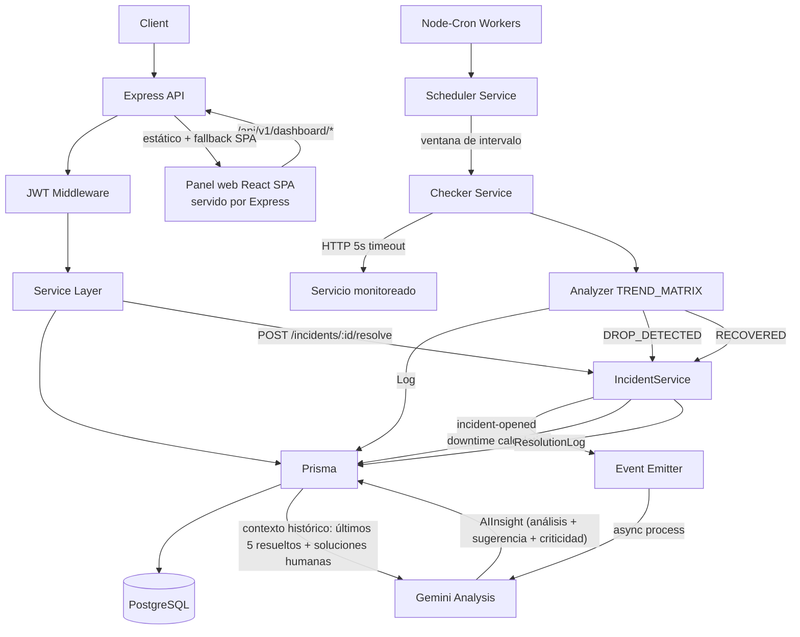

# 🛡️ OpsMind — Microservice Monitoring & Incident Analysis


[](./LICENSE)
[](https://nodejs.org/)
[](./SECURITY.md)

OpsMind es una plataforma de monitoreo de servicios y gestión de incidentes con análisis asistido por IA: API REST en Node.js y TypeScript, workers en segundo plano, PostgreSQL, autenticación JWT y un panel web operativo (React) servido por la misma API. Cuando detecta una caída crea un incidente, genera un diagnóstico estructurado con Gemini y, al recuperarse el servicio, calcula el downtime y conserva el incidente como contexto histórico para futuros análisis.


---

# 🌐 Demo en vivo

* **Panel web:** https://opsmind-e07b.onrender.com
* **API + Swagger:** https://opsmind-e07b.onrender.com/api-docs

## Acceso de prueba

El panel ofrece una cuenta demo para explorar la plataforma sin registrarse:

* **Credenciales:** `demo@opsmind.com` / `demo1234`
* En el login, el botón **"Explorar con cuenta demo"** inicia sesión con un clic.
* Se habilita con las variables opcionales `DEMO_EMAIL` y `DEMO_PASSWORD`; sin ellas el acceso demo queda deshabilitado.

> Desplegado en Render (Native Node, `NODE_VERSION=22`), mismo origen para API y panel — sin CORS.

---

# 🚀 Quick Start

## 1. Clonar e instalar

```bash
git clone https://github.com/LENINMORENO13/OpsMind.git
cd OpsMind
cp .env.example .env
```

Configura `JWT_SECRET` (obligatorio), `GEMINI_API_KEY` (análisis IA) y `POSTGRES_PASSWORD` (obligatoria para Docker) en `.env`. La conexión local a PostgreSQL usa el puerto `5433`.

## 2. Levantar con Docker

```bash
docker compose up --build
```

* Panel web: http://localhost:3000
* Swagger: http://localhost:3000/api-docs
* PostgreSQL: puerto `5433` en el host

```bash
docker compose down
```

## 3. Desarrollo local (sin Docker)

```bash
# Terminal 1 — API
npm run dev

# Terminal 2 — Panel web (Vite, puerto 5173)
cd frontend && npm run dev
```

---

# ✨ Características Principales

* Monitoreo periódico de disponibilidad con workers `node-cron` e historial de estados
* Gestión del ciclo de vida de incidentes con cálculo automático de downtime
* Análisis de incidentes con Gemini (diagnóstico + sugerencia + criticidad), desacoplado por eventos y con contexto histórico de los últimos 5 incidentes resueltos
* Registro de soluciones humanas verificadas (HITL: `rootCause` + `actionTaken`) por incidente
* Autenticación JWT, rate limiting en auth, Helmet y validación SSRF (solo IPs públicas)
* API REST con Swagger/OpenAPI, validación con Zod y envelope de respuesta consistente
* Panel web operativo con CRUD de monitores y resolución de incidentes desde la interfaz
* Health checks (`/health`, `/health/ready`) para orquestadores
* Docker, CI/CD con GitHub Actions y despliegue continuo

---

# 🛠️ Stack Tecnológico

| Tecnología       | Uso                    |
| ---------------- | ---------------------- |
| Node.js          | Runtime                |
| TypeScript       | Lenguaje               |
| Express          | API HTTP               |
| Express Rate Limit | Rate limiting (auth) |
| Helmet           | Cabeceras de seguridad |
| Prisma ORM       | Acceso a datos         |
| PostgreSQL       | Persistencia           |
| Node-Cron        | Background workers     |
| Jest + Supertest | Testing                |
| Swagger UI       | Documentación          |
| OpenAPI 3.0      | Especificación         |
| Zod              | Validación de datos    |
| Axios            | HTTP health checks     |
| Docker           | Contenedores           |
| GitHub Actions   | CI/CD (integración y despliegue continuos) |
| @google/genai    | Integración con Gemini |
| React            | Panel web operativo (SPA) |
| Vite             | Build del panel web    |
| Tailwind CSS     | Estilos del panel web  |
| React Router     | Rutas del panel web    |
| Recharts         | Gráficos del panel web |
| Lucide           | Iconos del panel web   |

---

# 📊 Panel operativo y métricas

Vistas del panel (React SPA servida por Express en el mismo origen — sin CORS):

* **Resumen** — monitores, incidentes, logs e insights en un vistazo
* **Monitores** — CRUD completo desde la interfaz
* **Incidentes** — activos con diagnóstico IA y resolución HITL
* **Métricas** — series temporales con gráficos (Recharts) por ventana: 24h, 7d, 30d y 90d
* **Insights** — análisis de IA recientes


Auto-refresh por polling (30 s) con indicador de última actualización.

---

# 🤖 Análisis con IA

Al detectarse una caída se crea el incidente y se emite el evento `incident-opened`; un listener desacoplado invoca Gemini, que devuelve un **diagnóstico estructurado**:

* Diagnóstico, causa probable y acción recomendada
* Nivel de criticidad (`LOW` → `CRITICAL`)
* `historicalAnalysis` — origen del diagnóstico (incidente actual o contexto histórico)

El prompt incorpora contexto de los últimos 5 incidentes resueltos del monitor, incluidas las soluciones humanas verificadas (`ResolutionLog`), sin que esto sustituya el análisis del incidente actual.

Ante errores de Gemini se reintenta (hasta 3 veces con delay configurable) y existe un mecanismo de fallback: un fallo persistente del proveedor nunca interrumpe el flujo principal de gestión de incidentes. Requiere `GEMINI_API_KEY`.

---

# 🧠 Arquitectura General


```mermaid
graph TD
    Client --> API[Express API]
    API --> Auth[JWT Middleware]
    Auth --> Services[Service Layer]
    Services --> Prisma
    Prisma --> DB[(PostgreSQL)]

    Web[Panel web React SPA<br>servido por Express] -->|"/api/v1/dashboard/*"| API
    API -->|"estático + fallback SPA"| Web

    Workers[Node-Cron Workers] --> Scheduler[Scheduler Service]
    Scheduler -->|"ventana de intervalo"| Checker[Checker Service]
    Checker -->|"HTTP 5s timeout"| External[Servicio monitoreado]
    Checker --> Analyzer[Analyzer TREND_MATRIX]
    Analyzer -->|Log| Prisma
    Analyzer -->|DROP_DETECTED| IncidentService
    Analyzer -->|RECOVERED| IncidentService

    IncidentService -->|"incident-opened"| Emitter[Event Emitter]
    Emitter -->|"async process"| AI[Gemini Analysis]
    AI -->|"AIInsight (análisis + sugerencia + criticidad)"| Prisma
    Prisma -->|"contexto histórico: últimos 5 resueltos + soluciones humanas"| AI

    IncidentService -->|"downtime calculation"| Prisma
    Services -->|"POST /incidents/:id/resolve"| IncidentService
    IncidentService -->|ResolutionLog| Prisma
```

---

# 📡 API Endpoints

## 🔐 Auth

| Método | Endpoint                | Descripción |
| ------ | ----------------------- | ----------- |
| POST   | `/api/v1/auth/register` | Registro    |
| POST   | `/api/v1/auth/login`    | Login + JWT |

---

## 📊 Monitors

**Authorization requerido:**

```http
Authorization: Bearer <token>
```

| Método | Endpoint               | Descripción      |
| ------ | ---------------------- | ---------------- |
| GET    | `/api/v1/monitors`     | Listar monitores |
| POST   | `/api/v1/monitors`     | Crear monitor    |
| PATCH  | `/api/v1/monitors/:id` | Actualizar       |
| DELETE | `/api/v1/monitors/:id` | Eliminar         |

---

## 🩺 Health checks

Endpoints públicos (sin `Authorization`), pensados para sondas de orquestador y balanceador:

| Método | Endpoint        | Descripción                                                                 |
| ------ | --------------- | --------------------------------------------------------------------------- |
| GET    | `/health`       | Liveness: el proceso responde. No consulta dependencias externas.           |
| GET    | `/health/ready` | Readiness: verifica la conexión a PostgreSQL. Responde `503` si la base cae. |

---

## 📈 Observabilidad

| Método | Endpoint                        | Descripción         |
| ------ | ------------------------------- | ------------------- |
| GET    | `/api/v1/monitors/status/all`   | Estado general      |
| GET    | `/api/v1/monitors/status/:site` | Estado por servicio |
| GET    | `/api/v1/monitors/:id/history`  | Historial           |

> **Nota:** `/status/all` y `/status/:site` ejecutan comandos reales de verificación y escriben en la base de datos.

---

## 📊 Dashboard Operativo

Endpoints de solo lectura (sin side effects) que alimentan el panel web. **Authorization requerido:**

```http
Authorization: Bearer <token>
```

| Método | Endpoint                                       | Descripción                                                       |
| ------ | ---------------------------------------------- | ----------------------------------------------------------------- |
| GET    | `/api/v1/dashboard/summary`                    | Resumen global (monitores, incidentes, logs, insights)            |
| GET    | `/api/v1/dashboard/monitors`                   | Monitores con contexto operativo (`includeInactive`, `limit`)     |
| GET    | `/api/v1/dashboard/incidents`                  | Incidentes recientes/abiertos por ventana (`window`, `monitorId`) |
| GET    | `/api/v1/dashboard/metrics`                    | Series temporales por bucket (`window`, `bucket`, `monitorId`)    |
| GET    | `/api/v1/dashboard/insights`                   | Insights IA recientes (`limit`)                                   |

---

## 🚨 Incidentes

| Método | Endpoint                                 | Descripción                                   |
| ------ | ---------------------------------------- | --------------------------------------------- |
| GET    | `/api/v1/incidents/active`               | Incidentes activos con diagnóstico IA         |
| GET    | `/api/v1/incidents/monitor/:monitorId/resolved` | Historial de incidentes resueltos por monitor |
| POST   | `/api/v1/incidents/:id/resolve`          | Registrar solución humana (`rootCause`, `actionTaken`) y cerrar el incidente según el estado del servicio |

La respuesta de `/api/v1/incidents/active` incluye, en cada `aiInsight`: `analysis` (diagnóstico), `suggestion` (recomendación), `criticality`, `historicalAnalysis` (origen del diagnóstico) y `createdAt`.

### Resolución manual de incidentes

`POST /api/v1/incidents/:id/resolve` (autenticado) registra la solución aplicada por un operador:

* Incidente `OPEN` + monitor sano (`UP`/`DEGRADED`) → se cierra el incidente (`closedNow: true`).
* Incidente `OPEN` + monitor caído → se registra la solución pero **el incidente permanece abierto** hasta la recuperación (`RECOVERED`).
* Incidente `RESOLVED` → solo se adjunta el log de la solución.

Errores: `400` (validación), `401` (no autorizado), `404` (incidente inexistente), `409` (ya existe solución registrada).

---

# 🧪 Pruebas Automatizadas

```bash
npm test
```

Incluye pruebas para:

* Autenticación JWT
* CRUD de monitores
* Validaciones HTTP (`400`, `401`, `404`)
* Integración con Prisma y PostgreSQL
* Flujo de creación y resolución de incidentes (incluye `POST /api/v1/incidents/:id/resolve`)
* Resolución manual con `ResolutionLog` (`closedNow`, duplicado `409`, incidente inexistente `404`)
* Análisis mediante IA (`analyzeIncident`, reintentos y fallback)
* Actualización de estado por tendencias (`TREND_MATRIX`)
* Protección SSRF y validaciones de URLs públicas
* Cadencia programada y throttling por ventana del scheduler
* Formateo y sanitización del contexto histórico (prompt-formatters)
* Endpoints del dashboard operativo (summary, monitors, incidents, metrics, insights)

---

# 📊 Estados del Sistema

Enums principales (detalle completo en Swagger, `/api-docs`): `ServiceStatus` (`UP`, `DEGRADED`, `DOWN`, `PENDING`), `TrendStatus` (`STABLE`, `RECOVERED`, `DROP_DETECTED`, `OFFLINE`), `IncidentStatus` (`OPEN`, `RESOLVED`, `IGNORED`) y `CriticalityLevel` (`LOW`, `MEDIUM`, `HIGH`, `CRITICAL`).

---

# 🔄 Roadmap

* ✅ **V1** — Monitoreo, JWT, workers, Docker, CI/CD y análisis IA
* ✅ **V2** — Memoria de incidentes, contexto histórico, HITL y panel operativo (Fases 1-4)
* ⏳ **Fase 5** — Mejora continua del AI Engine

---

# 📄 Licencia

Este proyecto está bajo la licencia **MIT**. Consulta el archivo [`LICENSE`](./LICENSE) para ver los términos completos.

```
Copyright (c) 2026 Lenin Moreno
```

---

# 👤 Autor

**Lenin Moreno** — Backend Developer

Proyecto personal enfocado en backend, monitoreo de servicios, gestión de incidentes y exploración de arquitecturas orientadas a eventos.

🛸 **¡Conectemos!**

* 🌐 [LinkedIn](https://www.linkedin.com/in/lenin-moreno/)
* 💼 [Portafolio Web / Gitvlg](https://leninmoreno13.gitvlg.com/)
